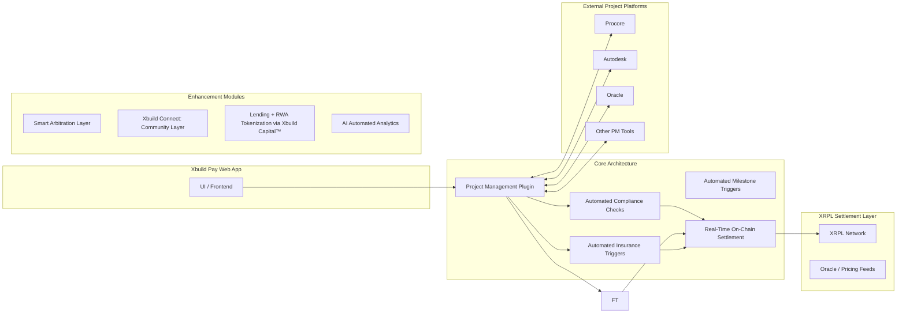

# Xbuild Pay Demo

## System Architecture Diagram



**Xbuild Pay** is a real-time settlement and workflow automation platform for the construction industry.  
It ensures that project execution, verification, and payment flows happen reliably, transparently, and without dispute.

This demo is a **visual prototype** showcasing how Xbuild Pay’s workflow logic and settlement triggers function in practice.

**Important:**  
The core workflow, trigger logic, compliance model, and settlement design are **authored and owned by Xbuild Pay**.  
Base44 was used only to prototype the UI layer for demonstration convenience.  
Xbuild Pay is a **standalone architecture**, independent of Base44.

---

## Core Architecture Layers

### 1. Project Management Execution Layer (Primary Coordination Layer)
Synchronizes real project workflows between:
- General contractors
- Sub-trades
- Suppliers
- Inspectors
- Insurers
- Owners

This layer **integrates directly into** existing construction management platforms:

Supported integration targets include:
- **Procore**
- **Autodesk Construction Cloud**
- **Oracle Primavera**
- Buildertrend / CMiC / Viewpoint (extensible)

No system replacement — **Xbuild Pay overlays and enhances what teams already use.**

---

### 2. Automated Compliance & Verification Layer
Compliance is embedded into workflow execution.

Verifies:
- Permits & safety checks
- Inspection sign-offs
- Material delivery confirmation
- Work progress checkpoints

Payments cannot release **unless objective conditions are met**.

---

### 3. Automated Field Triggers
Real site activity updates milestone state automatically:

- Delivery scans
- Site reports
- Inspection confirmations
- Photo/video documentation
- Optional IoT inputs

These events **directly control payment eligibility**.

---

### 4. Automated Insurance Triggers
Insurance logic responds to on-site conditions:

- Safety events
- Delay claims
- Change orders
- Quality issues

Risk effects are reflected in **settlement conditions immediately.**

---

### 5. Real-Time On-Chain Settlement (Financial Finality Layer)
Once conditions are met:

✅ Settlement executes **on-chain**  
✅ Audit trail is **permanent**  
✅ Funds release is **dispute-resistant**  
✅ No payment limbo, retainage ambiguity, or manual chasing

---

## Intelligence Layer (New)

### **AI Automated Analytics**
Xbuild Pay analyzes real-time:
- Field activity streams
- Progress data
- Risk indicators
- Performance patterns

To provide:
- Delay predictions
- Risk scoring
- Cost overrun forecasting
- Work quality trend detection

This allows proactive decision-making **before disputes occur**, not after.

---

## Optional Enhancement Modules

### Arbitration Hub
Decentralized dispute resolution for escalation scenarios.

### Xbuild Connect (Community Coordination Layer)
Shared data + communication environment across stakeholders.

### Built-In Lending (via **Xbuild Capital**)
Access working capital backed by verified project receivables.

### RWA Tokenization (via **Xbuild Capital**)
Tokenization of real-world construction payment flows for liquidity and structured capital markets.

---

## Tech Stack

| Layer | Technology |
|------|------------|
| Demo UI Layer | Prototyped using Base44 (interface visualization only) |
| Workflow & Triggers | Xbuild Pay Core Engine |
| Settlement | XRPL Ledger |
| PM System Integration | Procore / Autodesk / Oracle (plugin layer) |
| Financial Extensions | Xbuild Capital |
| Analytics Layer | AI-Driven Pattern & Risk Prediction Models |

---

## Run the Demo Locally

```bash
npm install
npm run dev
